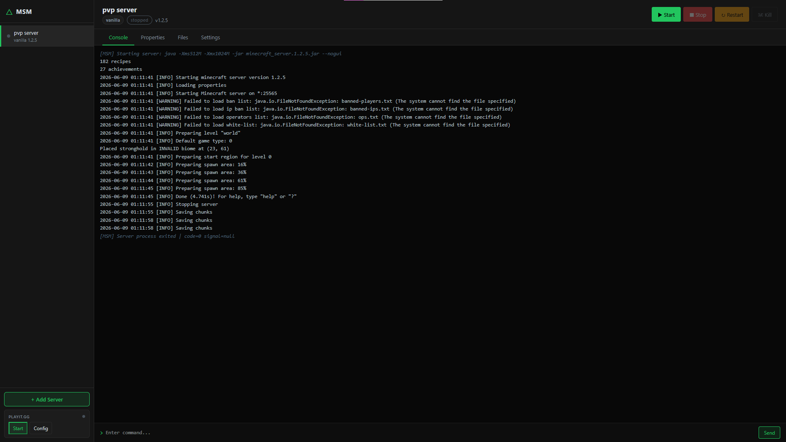

# Minecraft Server Manager

A lightweight, web-based Minecraft server manager. Point it at an existing server folder and it attaches automatically, or let it create a brand-new vanilla server from scratch. No Docker, no Java wrappers, no bloat — just Node.js and a browser.


---

## Features

- **Attach to any existing server** — paste a folder path, hit Detect, and it reads the jar to figure out the type automatically
- **Create vanilla servers** — picks any release or snapshot from Mojang's API and downloads the jar for you
- **Works with modded and plugin servers** — Forge, Fabric, NeoForge, Paper, Spigot, Bukkit, Purpur, Sponge
- **Real-time console** — WebSocket-powered terminal with command input and scrollback buffer
- **Properties editor** — edit `server.properties` through a form, common settings shown prominently
- **File browser** — navigate your server directory from the web interface
- **Per-server settings** — RAM allocation, Java path, extra JVM flags, jar file selection
- **playit.gg integration** — start a playit tunnel from the sidebar, see the tunnel address and claim URL live
- **Windows and Linux** — no platform-specific dependencies
- **No build step** — vanilla HTML/CSS/JS frontend, runs straight from `node server.js`

---

## Screenshots



---

## Requirements

- [Node.js](https://nodejs.org/) >= 18
- [Java](https://adoptium.net/) (any version your server needs, must be in PATH or set manually per server)
- A Minecraft server folder, or an internet connection to download one

---

## Installation

```powershell
git clone https://github.com/zaloguj12/minecraft-server-manager.git
cd minecraft-server-manager
npm install
npm start
```

Then open `http://localhost:8080` in your browser.

To use a different port:

```powershell
$env:PORT = 9000; node server.js
```

On Linux:

```bash
PORT=9000 node server.js
```

---

## Usage

### Attaching an existing server

1. Click **+ Add Server** in the sidebar
2. Select the **Attach Existing** tab
3. Paste the full path to your server folder (e.g. `C:\servers\my-smp` or `/home/minecraft/server`)
4. Click **Detect** — it will read the folder and identify the server type, version, and jar file
5. Set a display name and RAM limits, then click **Add Server**

### Creating a new vanilla server

1. Click **+ Add Server** in the sidebar
2. Select the **Create New** tab
3. Choose a Minecraft version from the dropdown (snapshots optional)
4. Set a name, install path, and RAM
5. Accept the EULA and click **Create Server**

The jar is downloaded directly from Mojang's API. A progress bar updates in real time.

### Supported server types

| Type | Detected by |
|------|-------------|
| Vanilla | jar name contains `minecraft_server` or `server` |
| Forge | jar name contains `forge` |
| Fabric | jar name contains `fabric-server` or `fabric-loader` |
| NeoForge | jar name contains `neoforge` |
| Paper | jar name contains `paper` |
| Purpur | jar name contains `purpur` |
| Spigot | jar name contains `spigot` |
| Bukkit / CraftBukkit | jar name contains `bukkit` or `craftbukkit` |
| Sponge | jar name contains `sponge` |

If the type can't be determined from the jar name, it falls back to checking whether a `mods/` or `plugins/` folder exists.

### playit.gg tunnels

[playit.gg](https://playit.gg) lets you expose your server to the internet without port forwarding.

1. Download the playit binary from [playit.gg/download](https://playit.gg/download)
2. Click **Config** in the playit widget at the bottom of the sidebar
3. Set the path to the binary and optionally a secret key
4. Click **Save & Start**

On first run (no secret key), a claim URL appears in the sidebar. Open it to link the tunnel to your account. Once claimed, your tunnel address appears automatically.

---

## Project Structure

```
minecraft-server-manager/
|-- server.js               Express + WebSocket server, all REST and WS routes
|-- package.json
|-- .gitignore
|
|-- src/
|   |-- serverManager.js    CRUD for server configs stored in data/servers.json
|   |-- serverDetector.js   Detects server type from folder, reads/writes server.properties
|   |-- serverCreator.js    Downloads vanilla server jars from Mojang's API
|   |-- processManager.js   Spawns and manages Java processes, WebSocket console broadcast
|   `-- playitManager.js    Manages the playit.gg subprocess and parses its output
|
|-- public/
|   |-- index.html          SPA shell
|   |-- style.css           Dark theme
|   `-- app.js              All frontend logic (vanilla JS, no framework)
|
`-- data/                   Auto-created at runtime, excluded from git
    `-- servers.json        Persisted server configs
```

---

## API Reference

All endpoints return JSON.

### Servers

| Method | Path | Description |
|--------|------|-------------|
| GET | `/api/servers` | List all servers with live status |
| POST | `/api/servers` | Attach an existing server |
| GET | `/api/servers/:id` | Get a single server |
| PUT | `/api/servers/:id` | Update server config |
| DELETE | `/api/servers/:id` | Remove from manager (no files deleted) |
| POST | `/api/servers/:id/start` | Start the server |
| POST | `/api/servers/:id/stop` | Graceful stop (sends `stop` command) |
| POST | `/api/servers/:id/kill` | Force kill (SIGTERM) |
| POST | `/api/servers/:id/restart` | Graceful restart |
| GET | `/api/servers/:id/properties` | Read `server.properties` |
| PUT | `/api/servers/:id/properties` | Write `server.properties` |
| GET | `/api/servers/:id/files` | Browse server directory (`?dir=relative/path`) |

### Utilities

| Method | Path | Description |
|--------|------|-------------|
| POST | `/api/detect` | Detect server type from a path without adding it |
| GET | `/api/minecraft/versions` | List Minecraft versions from Mojang (`?snapshots=true`) |
| POST | `/api/minecraft/create` | Create a new vanilla server (async, progress via WebSocket) |

### playit.gg

| Method | Path | Description |
|--------|------|-------------|
| GET | `/api/playit/status` | Current status, tunnels, and claim URL |
| POST | `/api/playit/start` | Start playit (`{ playitPath, secretKey }`) |
| POST | `/api/playit/stop` | Stop playit |

### WebSocket

| Channel | Description |
|---------|-------------|
| `ws://host/ws/console/:serverId` | Bidirectional — server pushes log lines, client sends commands |
| `ws://host/ws/notifications` | Server pushes status change events and creation progress |

---

## Configuration

There is no config file. Everything is set per server through the Settings tab in the UI.

The only global option is the port, set via the `PORT` environment variable (default: `8080`).

Server configs are persisted automatically to `data/servers.json` which is created on first run.

---

## Known Limitations

- File browser is read-only (navigation only, no editing)
- No player list, ops, or whitelist management UI
- No scheduled tasks or auto-restart on crash
- No backup management
- No authentication — intended for local or LAN use only
- No HTTPS — run behind a reverse proxy (nginx, Caddy) if you need remote access

---

## License

[CC BY-NC 4.0](LICENSE) — free to use and modify for non-commercial purposes, with attribution.
